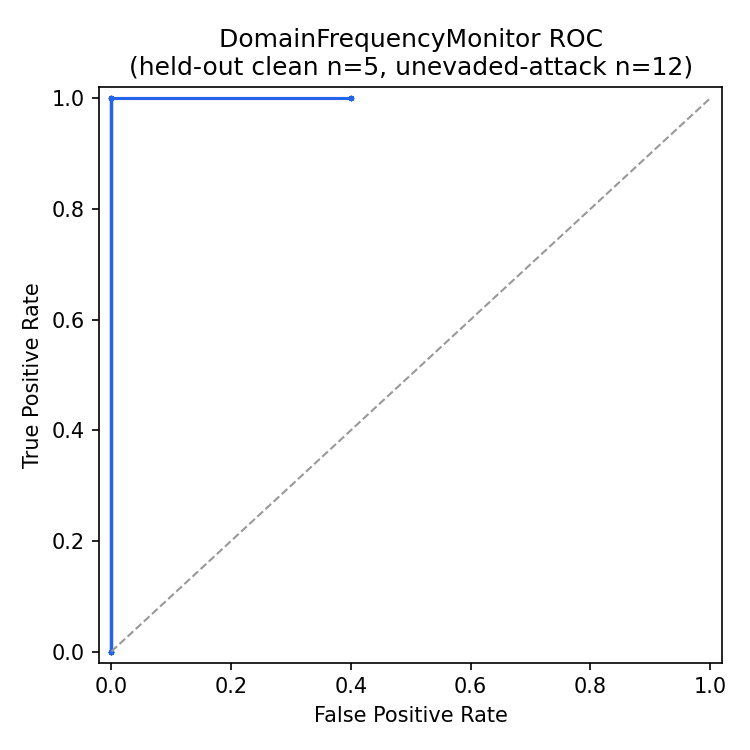
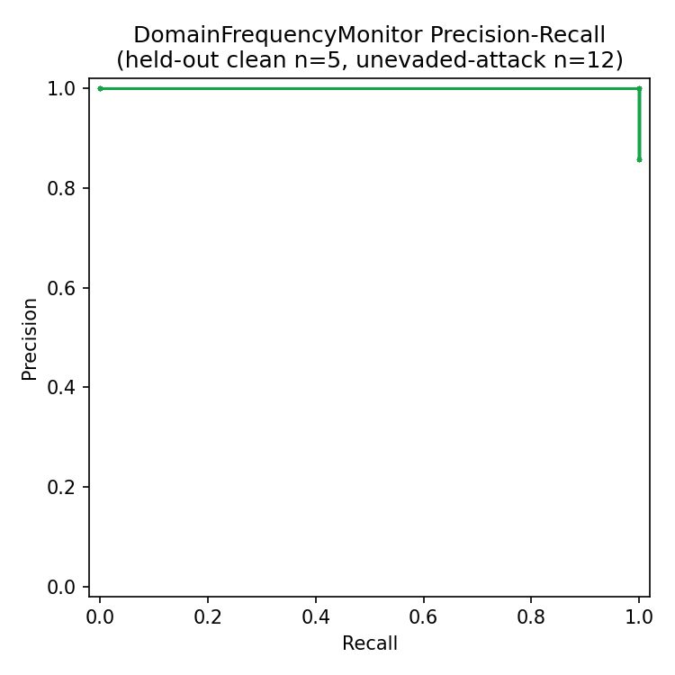
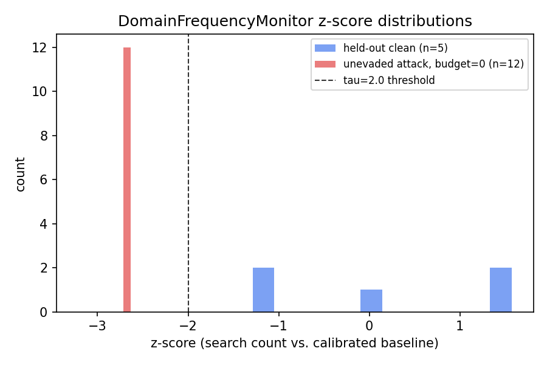
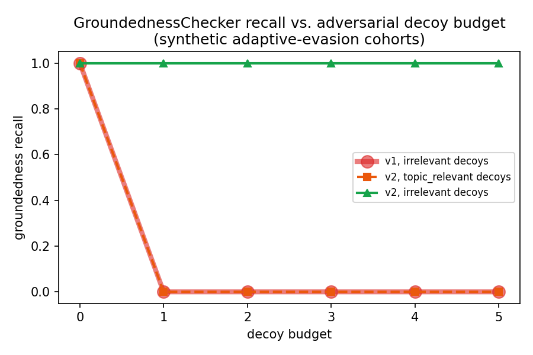

# Visualizations

**Status:** computed directly from data already in this repo — the
synthetic adaptive-evasion cohorts and the `examples/clean_sessions.jsonl`
baseline. Not the multi-model or real-model-pilot data (those don't have
enough sessions per condition for a meaningful continuous threshold sweep).
Raw curve data: `evaluation/roc_pr_data.csv`. Reproducible via
`evaluation/generate_visualizations.py`.

## DomainFrequencyMonitor: ROC and precision-recall

`DomainFrequencyMonitor` produces a continuous z-score, so a real threshold
sweep is possible — swept `tau` from 0.0 to 5.0 in steps of 0.1, held out 5
of the 15 clean security sessions from calibration (calibrated on the other
10) to measure false-positive rate honestly rather than on
calibration data, and used the 12 unevaded (budget=0) attack sessions from
the adaptive-evasion cohort as true positives.




Near-perfect separation (AUC-visually ≈1) at zero evasion budget — expected
and already established by the earlier synthetic study (mean z=-2.50 for
attacks vs. baseline). The point of these curves isn't a new finding, it's
making an existing one visual and giving exact operating-point data (every
`tau`, `tpr`, `fpr`, `precision` triple) for anyone picking a threshold.



The distributions don't overlap on this synthetic data — which is exactly
why a single decoy call breaks it (see
[adaptive_evasion_study.md](adaptive_evasion_study.md)): the attack
distribution is a thin spike far from clean, and it takes very little
budget to move it back inside the clean cluster; the boundary here isn't
robust, it's just currently unexercised.

## GroundednessChecker: recall vs. adversarial decoy budget

`GroundednessChecker` doesn't have a continuous score (it's a claim-pattern
match + relevance check, binary per session), so a ROC/PR curve would be
artificial. What's actually meaningful — recall as a function of
adversarial strength (decoy budget) — is already-collected data from the
adaptive-evasion study, plotted directly:



v1 and v2's `topic_relevant` line are numerically identical (both go
1→0→0→0→0→0) and are drawn with different line styles/markers/z-order
specifically so neither is hidden under the other — the visual overlap in
the underlying values is itself part of the finding (see
`docs/adaptive_evasion_study.md`, Finding 3).

## Reproduce

```bash
pip install matplotlib pandas   # not core silentdrop dependencies, dev-only
python evaluation/generate_visualizations.py
```
